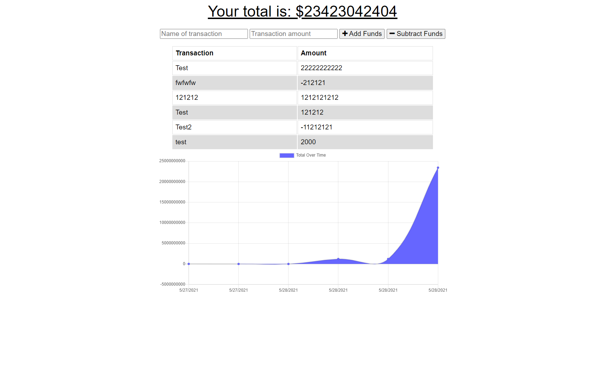

# Budget Tracker

# Contact
Github:
Vygoth

Email:
JeremyJoanet@protonmail.com

## Description
This application allows users to track income and spending with or without online access.

## Table of Contents
- [Usage](#Usage)
- [Installation](#Dependancies)
- [Testing](#Testing)
- [Credits](#Credits)
- [License](#License)
- [Contributing](#Contributing)
- [License Information](#LicenseInfo)
- [Screenshot](#Screenshot)

## Usage
Simply navigate to the deployed heroku site for easy access.

## Dependancies
<npm i>, however this application is on Heroku.

## Testing
N/A

## Credits
Michael Francisco

## Contributing
N/A

## Screenshot

